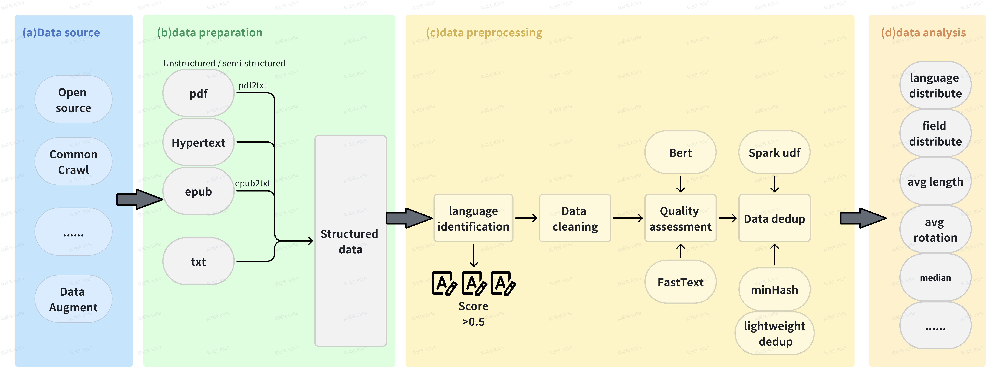

pipeline流程为：

<div id=top align="center">


[](https://pypi.org/project/flagdata/)
[](https://github.com/FlagOpen/FlagData/actions/workflows/python-app.yml)
[](https://github.com/FlagOpen/FlagData/blob/main/LICENSE)


   | [English](README.md) | [中文](README_zh.md) |

</div>

-----------------------------------------------------------------------
Data is one of the essential elements in the development of artificial intelligence. With the continuous breakthrough of large-scale pre-training models and related technologies, using efficient data processing tools to improve data quality in the corresponding research becomes increasingly important. Therefore, we present **FlagData**, a data processing toolkit that is easy to use and expand. FlagData integrates the tools and algorithms of multi-step data processing, including cleaning, condensation, annotation and analysis, providing powerful data processing support for model training and deployment in multiple fields, including natural language processing and computer vision.

FlagData supports the following features:

* Able to be used with simple configuration after installation. Realize customization functions with a few lines of code.

* Provide methods that condense training data based on the distillation algorithm, achieving competitive performance with full-data training.

* Help obtain high-quality structured data from raw html/text quickly. Sensitive information can be filtered out to avoid the risk of privacy disclosure.

* Support the data annotation of multiple tasks in natural language processing and computer vision. The annotation results are convenient to be read and use.

## News
- [Jan 31st, 2023] FlagData v1.0.0 is released! 

--------------------------------------------------------------------------------

- [Prerequisites and installation](#prerequisites-and-installation)
- [Quick Start](#quick-start)
    - [Data Cleaning](#data-cleaning)
    - [Data Analysis](#data-analysis)
    - [Data Condensation](#data-condensation)
    - [Data Annotation](#data-annotation)
- [Configuration](#configuration)
- [Tutorials](#tutorials)
- [Contact us](#contact-us)
- [Reference](#reference)
- [License](#license)

## Prerequisites and Installation
- Python version >= 3.9
- Pytorch version >= 1.11 if you want to use condensation module. Please refer to the [official website](https://pytorch.org/get-started/locally/) and install the appropriate PyTorch version based on your environment.
- Optional: [NGINX](https://www.nginx.com/resources/wiki/start/topics/tutorials/install/) is required if you want to use the annotation module. Follow the [Quick Start](#quick-start) to setup once nginx is installed.
Install FlagData with all modules via pip. By doing this, the dependencies for all modules will be installed:
```bash
pip install flagdata[all]
```
Install preferred Flagdata modules via pip (`module` need to be replaced by module's name, such as `cleaner`, `condensation`, `analysis`, etc. ). By doing this, only the specified module's dependencies will be installed. This is for users who only want to use a specific module and do not want to install the other dependencies:
```bash
pip install flagdata[module]
```

**Install the latest main-branch version**

If you want to install the up-to-date version from main branch, 
use the following method: 
```
pip install .[all]
```

**Develop FlagData locally**
```bash
git clone https://github.com/cofe-ai/FlagData.git
pip install -r requirements.txt
```

## Quick Start

### Data Cleaning
There are basically 2 steps in order to use our FlagData Cleaner tool:

1. Modify the YAML config file according to your data format. We have written detailed comments in the configuration file to explain the meaning of each parameter. You can also refer to [Configuration](#configuration).

2. Specify the path to the configuration file and run!
    ```python
    from flagdata.cleaner.text_cleaner import DataCleaner
    # use safe importing of main module in multi-processing  
    if __name__ == "__main__": 
        # you need to specify your own configuration file path
        cleaner = DataCleaner("config.yaml")
        cleaner.clean()
    ```
    
The cleaned data will be saved to the corresponding path in `jsonl` format according to the `output` parameter in the configuration file.

### Data Analysis
The quickest way to use our analyzer is to use our client to call the official demo server and specify the language.

```python
from flagdata.analysis.text_analyzer import CoreNLPAnalyzer
# call the official demo server, or you can setup you own server
analyzer = CoreNLPAnalyzer(url="https://corenlp.run", lang="en")
data = "FlagData is a fast and extensible toolkit for data processing provided by BAAI. Enjoy yourself! "
tokenized_text = analyzer.tokenize(data)
print(tokenized_text)
# [['FlagData', 'is', 'a', 'fast', 'and', 'extensible', 'toolkit', 'for', 'data', 'processing', 'provided', 'by', 'BAAI', '.'], ['Enjoy', 'yourself', '!']]
pos_tags = analyzer.pos_tag(data)
print(pos_tags)
# [['NNP', 'VBZ', 'DT', 'JJ', 'CC', 'JJ', 'NN', 'IN', 'NN', 'NN', 'VBN', 'IN', 'NN', '.'], ['VB', 'PRP', '.']]
ners = analyzer.ner(data)
print(ners)
# [[{('BAAI', (74, 78)): 'ORGANIZATION'}], []]
analyzer.close()
```

### Data Condensation

There are basically 2 steps in order to use our FlagData Condensation tool:

1. Modify the YAML configuration file. We have written detailed comments in the configuration file to explain the meaning of each parameter. You can also refer to [Configuration](#configuration).

2. Specify the path to the config file and run!
   
   ```python
   from flagdata.condensation.data_distillation import DataDistillationTrainer
   # you need to specify your own configuration file path here
   trainer = DataDistillationTrainer("flagdata/config/distillation_config.yaml") 
   # data should be in jsonl format with keys: "text", "label"
   trainer.load_data()
   # fit() will run data condensation training and save the distilled data in binary format which can be read by torch.load()
   # you can specify the save path by setting "distilled_save_path" in config file
   trainer.fit()
   ```

### Data Annotation

1. Put the `flagdata/annotation/dist` folder under the default `html` of nginx.

2. Modify `nginx.confg` to add location.

   ```
   location / {
       root /{your html path}/dist;   # change
       index index.html index.htm;
       try_files $uri $uri/ /index.html;
   }
   ```

3. Restart nginx.

4. Access the IP address configured by nginx.

## Configuration
For the `Cleaner` and `Condensation` modules, we provide the following configuration templates: [cleaner_config.yaml](https://dorc.baai.ac.cn/resources/projects/FlagData/cleaner_config.yaml), [distillation_config.yaml](https://dorc.baai.ac.cn/resources/projects/FlagData/distillation_config.yaml). The config files are in human-readable [YAML](https://yaml.org) format with detailed comments. Make sure you've modified related parameters before using.

You may need to pay attention to the following parameters:
### Cleaner
```yaml
  # path of the raw data to be cleaned.
  input: ./demo/demo_input.jsonl
  # cleaned data file save path
  output: ./demo/output.jsonl
```
### Condensation
```yaml
  train_data_path: <path to your train data>
  test_data_path: <path to your test data>
  # pretrained models from huggingface
  model_name: "/data/scripts/pretrained_models/distilbert-base-uncased"
  # model.fit() will run data condensaton algorithm and save distilled data here with binary format which can be read by torch.load()
  distilled_save_path: <path to save distilled data>
  # optional: load distilled data before training for initialization or to resume training
  distilled_load_path: null
```

## Tutorials

We provide a series of tutorials to help you quickly get started using FlagData's features.
* [Tutorial 1: Clean raw text data crawled from the Internet](/docs/tutorial_01_cleaner.md)
* [Tutorial 2: Analyze and process text data](/docs/tutorial_02_analysis.md)
* [Tutorial 3: Using data distillation to reduce data usage](/docs/tutorial_03_condensation.md)
* [Tutorial 4: Annotation for NLP tasks](/docs/tutorial_04_text_annotation.md)
* [Tutorial 5: Annotation for CV tasks](/docs/tutorial_05_image_annotation.md)

## Contact Us
If you have any questions about FlagData's usage and code, you can raise your issues. 
You can also contact us through email at data@baai.ac.cn. 

## Reference
The project are partially based on 
[GeneralNewsExtractor](https://github.com/GeneralNewsExtractor/GeneralNewsExtractor), 
[emoji](https://github.com/carpedm20/emoji),
[text-data-distillation](https://github.com/arumaekawa/text-dataset-distillation), 
[transformers](https://github.com/huggingface/transformers).

## License
FlagData is licensed under the [Apache 2.0 license](LICENSE).
