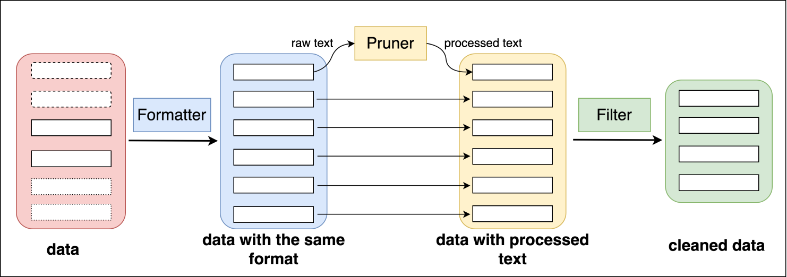
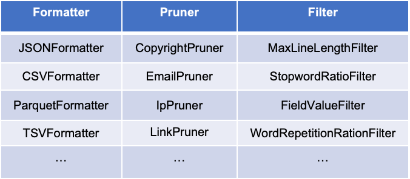

<div id=top align="center">


[](https://pypi.org/project/flagdata/)
[](https://github.com/FlagOpen/FlagData/blob/main/LICENSE)


| [English](README.md) | [中文](README_zh.md) |

</div>

-----------------------------------------------------------------------
Data is one of the basic elements in the development of artificial intelligence. With the continuous breakthrough of
large-scale pre-training model and related technology, it is becoming more and more important to use efficient data
processing tools to improve data quality in the corresponding research. So we launched FlagData, an easy-to-use and
easy-to-extend data processing toolkit. FlagData integrates several data processing tools and algorithms including data
acquisition, data preparation, data preprocessing and data analysis, which provides a strong data level support for
model training and deployment in natural language processing, computer vision and other fields.

FlagData supports the following features:

* Realize the high-quality content extraction of various original format data, and greatly reduce the processing cost.

* Provide the function of fine-tuning data perspective for large models.

* One-stop efficient distributed data processing function.

The complete pipeline process and features such as


## News
- [June 13st, 2024] FlagData v3.0.0 update, supports multiple data types, dozens of operator pools for DIY, and generates high-quality data with one click
- [Dec 31st, 2023] FlagData v2.0.0 has been upgraded
- [Jan 31st, 2023] FlagData v1.0.0 is online!

--------------------------------------------------------------------------------

- [Installation](#Installation)
- [Quick Start](#Quick-Start)
    - [Data acquisition phase](#Data-acquisition-phase)
    - [Data preparation phase](#Data-preparation-phase)
    - [data preprocessing phase](#data-preprocessing-phase)
        - [Language recognition](#Language-recognition)
        - [Data cleaning](#Data-cleaning)
        - [Quality assessment](#Quality-assessment)
        - [Data deduplication](#Data-deduplication)
    - [Data analysis phase](#Data-analysis-phase)
- [Configuration](#Configuration)
    - [Data cleaning](#Data-cleaning)
    - [Data Quality assessment](#Data-Quality-assessment)
- [Operator Pool](#Operator-Pool)
- [Strong community support](#Strong-community-support)
- [Users](#Users)
- [Reference project](#Reference-project)
- [License](#License)

# V3.0.0 UPDATE
With the feedback from the community, FlagData has been upgraded. This update provides a set of fool-proof language pre-training data construction tools. According to different data types, we provide one-click data quality improvement tasks such as Html, Text, Book, Arxiv, Qa, etc. Both novice users and advanced users can easily generate high-quality data.
- Novice users: Just confirm the data type to generate high-quality data.
- Advanced users: We provide dozens of operator pools for users to DIY their own LLM pre-training data construction process.

**Project Features:**

- Ease of use: Fool-style operation, simple configuration is all that is needed to generate high-quality data.
- Flexibility: Advanced users can customize the data construction process through various operator pools.
- Diversity: Supports multiple data types (HTML, Web, Wiki, Book, Paper, QA, Redpajama, Code)

**Key highlights**

- 🚀 Generate high-quality data with one click
- 🔧 Dozens of operator pools for DIY
- 🌐 Support for multiple data types

## Installation

- Under the requirements.txt file, are all the dependent packages of the FlagData project

```bash
pip install -r requirements.txt
```

**Install the latest version of the main branch**

The main branch is officially released by FlagData. If you want to install / update to the latest version of the main
branch, use the following command:

```
git clone https://github.com/FlagOpen/FlagData.git
```

## Quick Start

### Data acquisition phase

The LLM interface is utilized to construct a series of single rounds of SFT data for different abilities with three
different strategies. The strategies include:

+ ImitateGenerator: augment data using several case samples as templates. Supports simultaneous generation of data in
  multiple languages.
+ AbilityExtractionGenerator: using the LLM interface, generalize the abilities contained in several case samples.
  Generate new samples and answers based on this collection of capabilities.
+ AbilityDirectGenerator: Generate new samples directly related to a specified ability type or task type. For example,
  if you specify the ability as "Logical Reasoning", you can generate a series of logical reasoning questions and
  answers. In order to increase the diversity of generated samples, it is supported to exclude already generated
  samples.

See [Instructions for using the Data Enhancement Module](flagdata/data_gen/README.md) for an example.

### Data preparation phase

Under the all2txt module, the unstructured / semi-structured files such as pdf2txt and epub2txt can be converted into
txt, and it can well solve the problem of incoherent text content caused by single column, double column, and the order
of Chinese text interspersed with charts.

At the same time, the types of elements after parsing are "Table", "FigureCaption", "NarrativeText", "ListItem", "
Title [Chapter Title]", "Address [E-mail]","PageBreak", "Header [Header]", "Footer [Footer]", "
UncategorizedText [arxiv vertical number]", "
Image, Formula, etc. Tool scripts provide two forms: keeping full text and saving by category resolution.

See [Instructions for using all2txt modules](flagdata/all2txt/README.md) for an example.

### Data preprocessing phase

#### Language recognition

Under the language_identification module, the language classifier of fastText is used to classify. The language
classifier of fastText is based on Wikipedia, Tatoeba and SETimes.
The above training uses n-grams as a feature and uses a hierarchical softmax. Supports 176 language classifications, and
finally outputs a score of 0: 1.

+ Each CPU core can process a thousand documents per second.
+ Do a language classification for each web page and get the score of the classification.
+ For general cleaning rules, if it is greater than 0.5, it is classified as a specific language, otherwise it indicates
  that the page is not sure what language it is and discards the page.

See [Instructions for using the language identification module](flagdata/language_identification/README.md) for an example.

#### Data cleaning

We provide one-click data quality improvement tasks such as Html, Text, Book, Arxiv, Qa, etc. For more customized functions, users can refer to the "data_operator" section.
##### TextCleaner
TextCleaner provides a fast and extensible text data cleaning tool. It provides commonly used text cleaning modules.
Users only need to select the text_clean.yaml file in cleaner_builder.py to process text data.
For details, see[Instructions for using TextCleaner](flagdata/cleaner/docs/Text_Cleaner.md)

##### ArxivCleaner
ArxivCleaner provides a commonly used arxiv text data cleaning tool.
Users only need to select the arxiv_clean.yaml file in cleaner_builder.py to process arxiv data.

##### HtmlCleaner
HtmlCleaner provides commonly used Html format text extraction and data cleaning tools.
Users only need to run the main method to process arxiv data.

##### QaCleaner
QaCleaner provides commonly used Qa format text extraction and data cleaning tools.
Users only need to run the main method to process Qa data.
For details, see[Instructions for using Qa](flagdata/cleaner/docs/Qa_Cleaner.md)

##### BookCleaner
BookCleaner provides a common book format text extraction and data cleaning tool.
Users only need to run the main method to process the book data.
For details, see[Instructions for using Book](flagdata/cleaner/docs/Book_Cleaner.md)

#### Quality assessment

BERT and fasttext were selected as the evaluation model because they have the following advantages:

1. BERT model performs well in text classification and understanding tasks, has strong language comprehension and
   representation ability, and can effectively evaluate text quality.
2. FastText model has efficient training and reasoning speed, while maintaining the classification performance, which
   can significantly reduce the training and reasoning time.

This paper compares different text classification models, including logical regression, BERT and FastText, to evaluate
their performance. In the experiment, BERTEval and FastText models perform well in text classification tasks, and
FastText model performs best in terms of accuracy and recall rate. [experimental results are from ChineseWebText]

See [Instructions for using the quality assessment module](flagdata/quality_assessment/README.md) for an example.

#### Data deduplication

deduplication Module provides the ability to deduplicate large amounts of text data, using MinHashLSH (Least Hash
Locally Sensitive Hash) by converting text into a series of hash values in order to compare similarities between texts.

We can control the parameter threshold, which represents the threshold of similarity, with values ranging from 0 to 1. A
setting of 1 means that there is an exact match and no text is filtered out. On the contrary, if a lower similarity
value is set, texts with slightly higher similarity will also be retained. We can set a higher threshold value as needed
to retain only those texts that are very similar, while discard those texts with slightly less similarity. The empirical
default value is 0.87. At the same time, we use the distributed computing power of Spark to deal with large-scale data,
the idea of MapReduce is used to remove duplicates, and tuned by spark to deal with large-scale text data sets
efficiently.

The following is the similar text iterated in the process of data deduplication, which has slight differences in line
wrapping and name editing, but the deduplication algorithm can identify two paragraphs of text that are highly similar.

```json lines
{
  "__id__": 3023656977259,
  "content": "\"2022海口三角梅花展\"已接待游客3万多名——\n三角梅富了边洋村\n一年四季,美丽的海南岛始终春意盎然、鲜花盛开,而作为海南省省花的三角梅就是其中最引人注目的鲜花品种之一,成为海南的一道亮丽风景线。\n\"可别小看这一盆盆普通的三角梅花,特别受游客喜爱。仅最近一个多月,我们就卖出了200多万元,盆栽三角梅销路火爆......吸引更多本地和外地游客来赏花、买花。(经济日报 记者 潘世鹏)\n(责任编辑:单晓冰)"
}
{
  "__id__": 3934190045072,
  "content": "记者 潘世鹏\n\"2022海口三角梅花展\"已接待游客3万多名——\n三角梅富了边洋村\n一年四季,美丽的海南岛始终春意盎然、鲜花盛开,而作为海南省省花的三角梅就是其中最引人注目的鲜花品种之一,成为海南的一道亮丽风景线。\n\"可别小看这一盆盆普通的三角梅花,特别受游客喜爱。仅最近一个多月,我们就卖出了200多万元,盆栽三角梅销路火爆。......吸引更多本地和外地游客来赏花、买花。(经济日报 记者 潘世鹏)"
}
```

Integration of a single capability of spark:

Most of the time, we want to use the distributed data processing capability of spark. Here is a way to transform an
ordinary function into a spark udf function, and then use the spark capability.

But for functions that want to be transformed into spark tasks, you need to meet:

1. Data parallelism: the input data of a function can be divided into multiple parts and processed in parallel.
2. Serializable and immutable: Functions in Spark must be serializable in order to be transmitted across different
   nodes.
3. Does not depend on a specific compute node: the execution of the function does not depend on the computing resources
   or data storage location of a particular node so that it can be executed on any node in the cluster.
4. Stateless or shareable state: functions do not depend on external states or only on shareable states. This ensures
   that there are no conflicts or race conditions when executing functions in parallel on different compute nodes.

When using UDF, you should consider performance and optimization. Some functions may work well in a local Python
environment, but may not be efficient in a distributed Spark environment.
For complex logic or functions that require a lot of memory, further optimization and consideration may be required. UDF
is designed for simple logic and data processing, and for more complex calculations, you may need to use the
Spark's native operator for processing.

The deduplication module provides a common Python function (to determine whether it is a substring of other strings) to
use spark udf rewriting, which makes it easy to use spark distributed capabilities. For more information, please
see `stringMatching.py` and `stringMatching.py`.

If the user simply changes the python function to a spark task, it will not work without a spark cluster. Here a
detailed document of building a cluster is written in detail, which is convenient for novice users.

See [Spark cluster building](flagdata/deduplication/README.md) for an example.

### Data analysis phase

The analysis data analysis module provides the following functions:

+ the average turn analysis code of the text, and calculate the average number of rounds (take the newline character as
  an example)

+ the domain distribution of the text

+ the language distribution of the text

+ length analysis of the text.

See [Instructions for using the analysis module](flagdata/analysis/README.md) for an example.

## Configuration

For the `data cleansing` and `data quality assessment` modules,
We provide a profile
template:[text_clean.yaml、arxiv_clean.yaml](flagData/cleaner/configs)， [bert_config.yaml](flagdata/quality_assessment/Bert/bert_config.yaml)。
The configuration file is readable [YAML](https://yaml.org) format , provides detailed comments. Please make sure that
the parameters have been modified in the configuration file before using these modules.

Here are some important parameters you need to pay attention to:

### Data cleaning

   ```yaml
   # 待清洗的原始数据
   input: ./demo/demo_input.jsonl
   # 清洗后数据的保存路径
   output: ./demo/output.jsonl
   # 待处理的字段
   source_key: text
   # key in the output file for saving
   result_key: cleanedContent
   # 需要选择的Pipline类
   cleaner_class: ArxivCleaner
   ```

### Data Quality assessment

   ```yaml
   # Data evaluation models can be derived from[ChineseWebText download](https://github.com/CASIA-LM/ChineseWebText)
   pretrained_model_path: "models/bert-base-chinese"
   checkpoint: "models/pretrain/2023-08-16-21-36/model-epoch_19-step_2999.pt"
   # The text_key field is the field being evaluated
   text_key: "raw_content"
   ```
## Operator Pool
We provide some basic operators for data cleaning, filtering, format conversion, etc. to help users build their own data construction process.

The operators provided are divided into three types: Formatter, Pruner, and Filter. Formatter is used to process structured data and can be used for mutual conversion of data in different formats; Pruner is used to clean text data; Filter is used for sample filtering.
The figure below shows these operators in different processing locations and a list of some of the operators





For detailed description, see[Instructions for using the data operator](flagdata/data_operator/Operator_ZH.md)

## Strong community support
### Community Support
If you have any questions about the use and code of this project, you can submit an issue. You can also contact us directly via email at data@baai.ac.cn;

An active community cannot be separated from your contribution. If you have a new idea, welcome to join our community, let us become part of open source, and contribute to open source together! ! !


Or follow the FlagOpen open source system, FlagOpen official website https://flagopen.baai.ac.cn/


### Questions and Feedback
- Please report issues and make suggestions through GitHub Issues, and we will respond quickly within 24 hours.
- You are also welcome to discuss actively in GitHub Discussions.
- If it is inconvenient to use GitHub, of course, everyone in the FlagData open source community can also speak freely. For reasonable suggestions, we will iterate in the next version.
  We will invite experts in the field to hold online and offline exchanges regularly to share the latest LLM research results.
## Users


## Reference project

Part of this project is referenced from the following code:
[GeneralNewsExtractor](https://github.com/GeneralNewsExtractor/GeneralNewsExtractor),
[text-data-distillation](https://github.com/arumaekawa/text-dataset-distillation),
[emoji](https://github.com/carpedm20/emoji),
[transformers](https://github.com/huggingface/transformers)。
[ChineseWebText](https://github.com/CASIA-LM/ChineseWebText)
[lid](https://github.com/facebookresearch/cc_net)
[unstructured](https://github.com/Unstructured-IO/unstructured)
[minHash](https://github.com/ChenghaoMou/text-dedup)

## License

The FlagData project is based on [Apache 2.0 ](LICENSE)。
