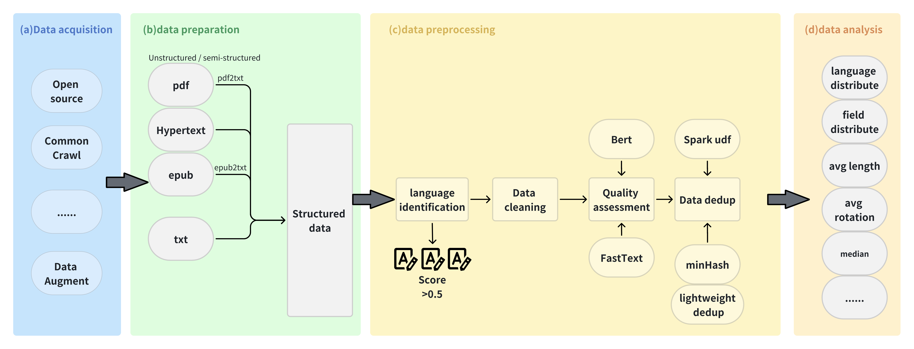

<div id=top align="center">


[](https://pypi.org/project/flagdata/)
[](https://github.com/FlagOpen/FlagData/actions/workflows/python-app.yml)
[](https://github.com/FlagOpen/FlagData/blob/main/LICENSE)


| [English](README.md) | [中文](README_zh.md) |

</div>

-----------------------------------------------------------------------
data is one of the basic elements in the development of artificial intelligence. With the continuous breakthrough of large-scale pre-training model and related technology, it is becoming more and more important to use efficient data processing tools to improve data quality in the corresponding research. So we launched FlagData, an easy-to-use and easy-to-extend data processing toolkit. FlagData integrates several data processing tools and algorithms including data acquisition, data preparation, data preprocessing and data analysis, which provides a strong data level support for model training and deployment in natural language processing, computer vision and other fields.

FlagData supports the following features:

* it can be used with simple configuration after installation, and the custom feature can be realized with low code volume.

* High-quality structured data can be quickly cleaned from the original html/text/pdf/epub, and sensitive information can be filtered to avoid the risk of privacy disclosure.

* Support massive text data de-duplication, and provide detailed multi-machine distributed data processing system deployment documents.

* support data quality assessment and common data analysis.

The complete pipeline process and features such as


##  News

- [Dec 15st, 2023] FlagData v1.1.0 has been upgraded
- [Jan 31st, 2023] FlagData v1.0.0 is online!

--------------------------------------------------------------------------------


- [Installation](#Installation)
- [Quick Start](#Quick-Start)
    - [Data acquisition phase](#Data-acquisition-phase)
    - [Data preparation phase](#Data-preparation-phase)
    - [data preprocessing phase](#data-preprocessing-phase)
        - [Language recognition](#Language-recognition)
        - [Data cleaning](#Data-cleaning)
        - [Quality assessment](#Quality-assessment)
        - [Data deduplication](#Data-deduplication)
    - [Data analysis phase](#Data-analysis-phase)
- [Configuration](#Configuration)
    - [Data cleaning](#Data-cleaning)
    - [Data Quality assessment](#Data-Quality-assessment)
- [Contact us](#Contact-us)
- [Reference project](#Reference-project)
- [License](#License)

## Installation

- Under the requirements.txt file, are all the dependent packages of the FlagData project

```bash
pip install -r requirements.txt
```

Optionally install the `cleaner` module required in FlagData. You will only install the dependency packages for the corresponding modules, which is suitable for users who only want to use the `cleaner` module and do not want to install other module dependency packages.

```bash
pip install flagdata[cleaner]
```

**Install the latest version of the main branch**

The main branch is officially released by FlagData. If you want to install / update to the latest version of the main branch, use the following command:

```
git clone https://github.com/FlagOpen/FlagData.git
pip install .[all]
```

**Secondary development based on source code**

```bash
git clone https://github.com/FlagOpen/FlagData.git
pip install -r requirements.txt
```

## Quick Start

### Data acquisition phase

The OpenAI interface is utilized to construct a series of single rounds of SFT data for different abilities with three different strategies. The strategies include:

+ ImitateGenerator: augment data using several case samples as templates. Supports simultaneous generation of data in multiple languages.
+ AbilityExtractionGenerator: using the OpenAI interface, generalize the abilities contained in several case samples. Generate new samples and answers based on this collection of capabilities.
+ AbilityDirectGenerator: Generate new samples directly related to a specified ability type or task type. For example, if you specify the ability as "Logical Reasoning", you can generate a series of logical reasoning questions and answers. In order to increase the diversity of generated samples, it is supported to exclude already generated samples.


  See [ReadMe under data_gen Module](flagdata/data_gen/README.md) for an example.


### Data preparation phase

Under the all2txt module, the unstructured / semi-structured files such as pdf2txt and epub2txt can be converted into txt, and it can well solve the problem of incoherent text content caused by single column, double column, and the order of Chinese text interspersed with charts.

At the same time, the types of elements after parsing are "Table", "FigureCaption", "NarrativeText", "ListItem", "
Title [Chapter Title]", "Address [E-mail]","PageBreak", "Header [Header]", "Footer [Footer]", "UncategorizedText [arxiv vertical number]", "
Image, Formula, etc. Tool scripts provide two forms: keeping full text and saving by category resolution.

See [ReadMe under all2txt Module](flagdata/all2txt/README.md) for an example.

### data preprocessing phase

#### Language recognition

Under the language_identification module, the language classifier of fastText is used to classify. The language classifier of fastText is based on Wikipedia, Tatoeba and SETimes.
The above training uses n-grams as a feature and uses a hierarchical softmax. Supports 176 language classifications, and finally outputs a score of 0: 1.

+ Each CPU core can process a thousand documents per second.
+ Do a language classification for each web page and get the score of the classification.
+ For general cleaning rules, if it is greater than 0.5, it is classified as a specific language, otherwise it indicates that the page is not sure what language it is and discards the page.

See [ReadMe under language_identification Module](flagdata/language_identification/README.md) for an example.

#### Data cleaning

The cleaner module uses multi-process pool mp.Pool to process data in parallel in a multi-process manner. Use SharedMemoryManager to create shareable data structures, and multiple processes share data in data processing.

Efficient data cleaning is achieved through multi-processes and shared memory:

Currently, the following cleaning rules are included:

+ Emoticons and meaningless characters (regular)
+ Clean and reprint copyright notice information (Zhihu, csdn, brief book, blog park)
+ Remove unreasonable consecutive punctuation marks, and newline characters are unified as\ n
+ Remove personal privacy, URL and extra spaces such as mobile phone number and ID number
+ Remove irrelevant content such as beginning and end, and remove text whose length is less than n (currently nasty 100)
+ Convert simplified Chinese to traditional Chinese (opencc Library)

It takes only two steps to use the data cleaning feature of FlagData:

1. Modify the data path and format in the YAML configuration file. We give detailed comments on each parameter in the configuration file template to explain its meaning. At the same time, you can refer to[Configuration](#Configuration) Chapter.

2. Specify the configuration file path in the following code and run it
   ```python
   from flagdata.cleaner.text_cleaner import DataCleaner
   if __name__ == "__main__": # Safe import of main module in multi-process
      cleaner = DataCleaner("config.yaml")
      cleaner.clean()
   ```

The cleaned file will be saved in the format `jsonl` to the path corresponding to the `output` parameter specified in the configuration file.

See [Tutorial 1: Clean the original text obtained from the Internet](/flagdata/cleaner/tutorial_01_cleaner.md) for an example.

#### Quality assessment

BERT and fasttext were selected as the evaluation model because they have the following advantages:

1. BERT model performs well in text classification and understanding tasks, has strong language comprehension and representation ability, and can effectively evaluate text quality.
2. FastText model has efficient training and reasoning speed, while maintaining the classification performance, which can significantly reduce the training and reasoning time.

This paper compares different text classification models, including logical regression, BERT and FastText, to evaluate their performance. In the experiment, BERTEval and FastText models perform well in text classification tasks, and FastText model performs best in terms of accuracy and recall rate. [experimental results are from ChineseWebText]

See [ReadMe under quality_assessment Module](flagdata/quality_assessment/README.md) for an example.

#### Data deduplication

deduplicationModule provides the ability to de-duplicate large amounts of text data, using MinHashLSH (Least Hash Locally Sensitive Hash) by converting text into a series of hash values in order to compare similarities between texts.

We can control the parameter threshold, which represents the threshold of similarity, with values ranging from 0 to 1. A setting of 1 means that there is an exact match and no text is filtered out. On the contrary, if a lower similarity value is set, texts with slightly higher similarity will also be retained. We can set a higher threshold value as needed to retain only those texts that are very similar, while discard those texts with slightly less similarity. The empirical default value is 0.87. At the same time, we use the distributed computing power of Spark to deal with large-scale data, the idea of MapReduce is used to remove duplicates, and tuned by spark to deal with large-scale text data sets efficiently.
The following is the similar text iterated in the process of data deduplication, which has slight differences in line wrapping and name editing, but the deduplication algorithm can identify two paragraphs of text that are highly similar.

```json lines
{
  "__id__": 1881195681200,
  "content": "新华社北京1月11日电 中共全国人大常委会党组10日举行会议,学习习近平总书记在二十届中央纪委二次全会上的重要讲话和全会精神,结合人大工作实际,研究部署贯彻落实工作。全国人大常委会委员长、党组书记栗战书主持会议并讲话......全国人大常委会党组副书记王晨,全国人大常委会党组成员张春贤、沈跃跃、吉炳轩、艾力更·依明巴海、王东明、白玛赤林、杨振武出席会议并发言。 (责任编辑:符仲明)"
}
{
  "__id__": 944892809591,
  "content": "新华社北京1月11日电 中共全国人大常委会党组10日举行会议,学习习近平总书记在二十届中央纪委二次全会上的重要讲话和全会精神,结合人大工作实际,研究部署贯彻落实工作。全国人大常委会委员长、党组书记栗战书主持会议并讲话......全国人大常委会党组副书记王晨,全国人大常委会党组成员张春贤、沈跃跃、吉炳轩、艾力更·依明巴海、王东明、白玛赤林、杨振武出席会议并发言。\n【纠错】\n【责任编辑:周楚卿\n】"
}
```

Integration of a single capability of spark:

Most of the time, we want to use the distributed data processing capability of spark. Here is a way to transform an ordinary function into a spark udf function, and then use the spark capability.

But for functions that want to be transformed into spark tasks, you need to meet:

1. Data parallelism: the input data of a function can be divided into multiple parts and processed in parallel.
2. Serializable and immutable: Functions in Spark must be serializable in order to be transmitted across different nodes.
3. Does not depend on a specific compute node: the execution of the function does not depend on the computing resources or data storage location of a particular node so that it can be executed on any node in the cluster.
4. Stateless or shareable state: functions do not depend on external states or only on shareable states. This ensures that there are no conflicts or race conditions when executing functions in parallel on different compute nodes.

When using UDF, you should consider performance and optimization. Some functions may work well in a local Python environment, but may not be efficient in a distributed Spark environment.
For complex logic or functions that require a lot of memory, further optimization and consideration may be required. UDF is designed for simple logic and data processing, and for more complex calculations, you may need to use the
Spark's native operator for processing.

The deduplication module provides a common Python function (to determine whether it is a substring of other strings) to use spark udf rewriting, which makes it easy to use spark distributed capabilities. For more information, please see `stringMatching.py` and `stringMatching.py`.

If the user simply changes the python function to a spark task, it will not work without a spark cluster. Here a detailed document of building a cluster is written in detail, which is convenient for novice users.

See [Spark cluster building](flagdata/deduplication/README.md) for an example.

### Data analysis phase

The analysis data analysis module provides the following functions:
+ the average turn analysis code of the text, and calculate the average number of rounds (take the newline character as an example)

+ the domain distribution of the text

+ the language distribution of the text

+ length analysis of the text.


See [ReadMe under analysis Module](flagdata/analysis/README.md) for an example.

## Configuration

For the `data cleansing` and `data quality assessment` modules,
We provide a profile template:[cleaner_config.yaml](https://dorc.baai.ac.cn/resources/projects/FlagData/cleaner_config.yaml)， [bert_config.yaml](flagdata/quality_assessment/Bert/bert_config.yaml)。
The configuration file is readable [YAML](https://yaml.org) format , provides detailed comments. Please make sure that the parameters have been modified in the configuration file before using these modules.

Here are some important parameters you need to pay attention to:

### Data cleaning

   ```yaml
   # Raw data to be cleaned
   input: ./demo/demo_input.jsonl
   # Save path of data after cleaning
   output: ./demo/output.jsonl
   ```

### Data Quality assessment

   ```yaml
   # Data evaluation models can be derived from[ChineseWebText download](https://github.com/CASIA-LM/ChineseWebText)
   pretrained_model_path: "models/bert-base-chinese"
   checkpoint: "models/pretrain/2023-08-16-21-36/model-epoch_19-step_2999.pt"
   # The text_key field is the field being evaluated
   text_key: "raw_content"
   ```

## Contact us

If you have any questions about the use and code of this project, you can submit issue. At the same time, you can contact us directly through data@baai.ac.cn.
An active community is inseparable from your contribution, if you have a new idea, welcome to join our community, let us become a part of open source, together to contribute our own efforts for open source!


## Reference project

Part of this project is referenced from the following code:
[GeneralNewsExtractor](https://github.com/GeneralNewsExtractor/GeneralNewsExtractor),
[text-data-distillation](https://github.com/arumaekawa/text-dataset-distillation),
[emoji](https://github.com/carpedm20/emoji),
[transformers](https://github.com/huggingface/transformers)。
[ChineseWebText](https://github.com/CASIA-LM/ChineseWebText)
[lid](https://github.com/facebookresearch/cc_net)
[unstructured](https://github.com/Unstructured-IO/unstructured)
[minHash](https://github.com/ChenghaoMou/text-dedup)

## License

The FlagData project is based on [Apache 2.0 ](LICENSE)。
