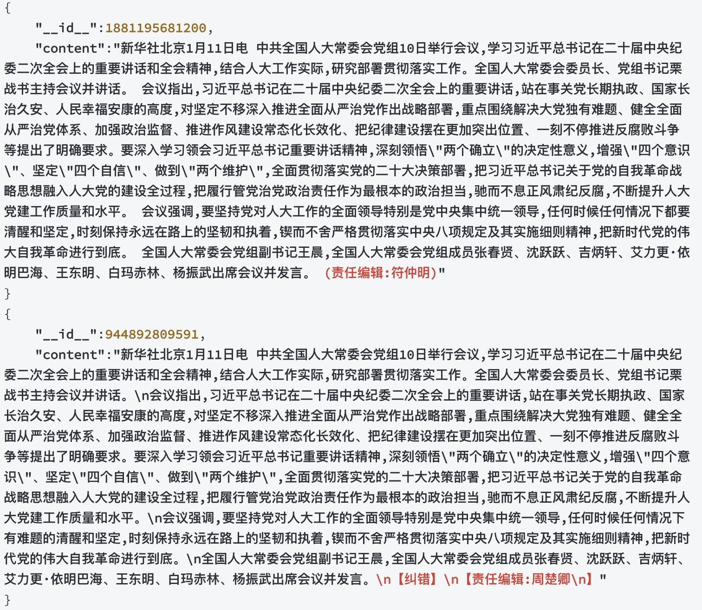

<div id=top align="center">


[](https://pypi.org/project/flagdata/)
[](https://github.com/FlagOpen/FlagData/actions/workflows/python-app.yml)
[](https://github.com/FlagOpen/FlagData/blob/main/LICENSE)


| [English](README.md) | [中文](README_zh.md) |

</div>

-----------------------------------------------------------------------
数据是人工智能领域发展的基础要素之一。随着大规模预训练模型及相关技术不断取得突破，在相应研究中使用高效数据处理工具提升数据质量变得越来越重要。因此我们推出了FlagData，一个便于使用且易于扩展的数据处理工具包。FlagData集成了包含数据来源、数据准备、数据预处理、数据分析等4个阶段的多个数据处理工具与算法，为自然语言处理、计算机视觉等领域的模型训练与部署提供了数据层面的有力支撑。

FlagData支持以下特性：

* 安装后简单配置即可上手使用，低代码量实现自定义功能。

* 可从原始html/text/pdf/epub 快速清洗得到高质量结构化数据，注重敏感信息滤除，避免隐私泄露风险。

* 支持海量文本数据去重，并提供详细的部署文档。

* 支持数据质量评估与常见数据分析。

完整的pipeline流程以及功能如下图：


## 动态
- [Dec 15st, 2023] FlagData v1.1.0 升级
- [Jan 31st, 2023] FlagData v1.0.0 上线了!

--------------------------------------------------------------------------------

- [安装](#安装)
- [快速上手](#快速上手)
    - [数据清洗](#数据清洗)
    - [数据分析](#数据分析)
    - [数据蒸馏](#数据压缩)
    - [数据标注](#数据标注)
- [配置](#配置)
- [使用指南](#使用指南)
- [联系我们](#联系我们)
- [参考项目](#参考项目)
- [许可证](#许可证)

## 安装
- requirements.txt 文件下，是FlagData项目所有的依赖包
```bash
pip install -r requirements.txt
```

选择性安装FlagData中所需的`cleaner`模块 。你将只会安装对应模块的依赖包，这适合那些只想使用`cleaner`模块且不想安装其他模块依赖包的使用者。
```bash
pip install flagdata[cleaner]
```

**安装main分支的最新版本**

main分支为FlagData正式发布的分支，如果你想安装/更新到main分支的最新版本，请使用以下命令：
```
git clone https://github.com/FlagOpen/FlagData.git
pip install .[all]
```

**基于源码二次开发**
```bash
git clone https://github.com/FlagOpen/FlagData.git
pip install -r requirements.txt
```

## 快速上手
### 1、数据来源阶段
我们提供了基于OpenAI接口的数据增强模块，
利用OpenAI接口，以三种不同策略，构建一系列针对不同能力的单轮SFT数据。策略包括：

+ ImitateGenerator：以若干案例样本为模板，扩增数据。支持同时生成多种语言数据。
+ AbilityExtractionGenerator: 利用OpenAI接口，归纳出若干案例样本中包含的能力。根据这个能力集合，生成新样本和答案。
+ AbilityDirectGenerator: 根据指定的能力类型，或者任务类型，直接生成与该能力或任务相关的新样本。例如，指定能力为“逻辑推理”，则可生成一系列逻辑推理题目及答案。为增强生成样本的多样性，支持排除已生成样本。

具体示例见[数据增强模块下的readMe](flagdata/data_gen/README_zh.md)
### 2、数据准备阶段
all2txt模块下，将pdf2txt、epub2txt等非结构化/半结构化的文件转成txt，并且可以很好的解决单栏、双栏，以及图表穿插中文本的顺序等导致问题文本内容不连贯的问题。

同时解析后的元素种类有"Table（表格）", "FigureCaption（图片标题）", "NarrativeText【正文】", "ListItem【参考文献】", "Title【章节标题】", "Address【邮箱地址】","PageBreak", "Header【页眉】", "Footer【页脚】", "UncategorizedText【arxiv竖排编号】", "Image(图)", "Formula（公式）" 等，工具脚本提供保留全文，以及按照类别解析保存两种形式。

具体示例见[all2txt模块下的readMe](flagdata/all2txt/README_zh.md)

### 3、数据预处理阶段
#### 3.1 语言识别
language_identification模块下，使用 fastText 的语言分类器来做分类，fastText 的语言分类器是在 Wikipedia、Tatoeba、SETimes 上面训练的，使用了 n-grams 来作为特征，使用了层级的 softmax。支持 176 种语言的分类，并且最后会输出一个 0~1 的分数。
+ 每个 CPU 核心上，每秒可以处理一千个文档。
+ 对于每一个网页做一次语言分类，得到分类的分数。
+ 对于一般清洗规则，如果大于 0.5，那么就分类为某个特定的语言，否则表示不确定是什么语言的网页并丢掉这个网页。
#### 3.2 数据清洗
cleaner模块，使用多进程池 mp.Pool，通过多进程方式并行处理数据。使用 SharedMemoryManager 创建可共享的数据结构，在数据处理中多进程共享数据。

通过多进程和共享内存的方式实现了高效的数据清洗：

目前包含如下清洗规则：

+ 表情符号和无意义字符（正则）
+ 清洗转载版权声明信息（知乎、csdn、简书、博客园）
+ 去除不合理的连续标点符号，换行符统一为\n
+ 去除手机号、身份证号等个人隐私、URL和额外的空格
+ 去除开头、结尾等无关内容，去除长度小于n的文本（目前n=100）
+ 简体中文转换为繁体中文（opencc库）

使用FlagData的数据清洗功能仅需两步：

1. 修改YAML配置文件中的数据路径与格式。我们在配置文件模板中为每个参数给出了详细的注释来解释其含义。同时你也可以参考[配置](#配置)章节。

2. 在以下代码中指定配置文件路径，运行即可
   ```python
   from flagdata.cleaner.text_cleaner import DataCleaner
   if __name__ == "__main__": # 多进程中主模块安全导入
      cleaner = DataCleaner("config.yaml")
      cleaner.clean()
   ```

清洗后的文件会以`jsonl`的格式保存到配置文件中指定的`output`参数对应的路径。

#### 3.3 质量评估
选择BERT和fasttext作为评估模型，是因为它们具有以下优点：

1. BERT模型在文本分类和理解任务中表现出色，具有强大的语言理解和表示能力，能够有效地评估文本质量。
2. FastText模型具有高效的训练和推理速度，同时保持分类性能，可以显著减少训练和推理时间。

文章比较了不同的文本分类模型，包括逻辑回归、BERT和FastText，以评估它们的性能。在实验中，BERTEval和FastText模型在文本分类任务中表现良好，其中FastText模型在精度和召回率方面表现最佳。【实验结果来自ChineseWebText】

具体示例见[quality_assessment模块下的readMe](flagdata/quality_assessment/README_zh.md)

#### 3.4 数据去重
deduplication模块下，提供海量文本数据去重能力，该阶段使用的是MinHashLSH（最小哈希局部敏感哈希）通过将文本转换为一系列哈希值，以便比较文本之间的相似性。

我们可以通过控制参数threshold，它代表了相似性的阈值，threshold值的范围是从0到1。设置为1时意味着完全匹配，任何文本都不会被过滤掉。相反，如果设置了较低的threshold值，相似性稍微高一些的文本也会被保留，我们可以根据需要设置更高的threshold值，以便只保留那些非常相似的文本，而丢弃那些相似性稍微低一些的文本，经验默认值为0.87；同时我们利用了Spark的分布式计算能力处理大规模数据，使用了MapReduce思想来实现去重，同时经spark调优，来高效地处理大规模文本数据集。
如下是在数据去重过程中迭代计算的相似文本，该文本在换行、编辑姓名等方面有细微区别，但是去重算法可以识别出两段文本高度相似。


### 数据分析
使用FlagData的数据分析功能最便捷的方式是利用我们提供的客户端请求CoreNLP官方的服务，示例代码如下：

```python
from flagdata.analysis.text_analyzer import CoreNLPAnalyzer
# 创建客户端以调用官方的demo服务
analyzer = CoreNLPAnalyzer(url="https://corenlp.run", lang="en")
data = "FlagData is a fast and extensible toolkit for data processing provided by BAAI. Enjoy yourself! "
tokenized_text = analyzer.tokenize(data)
print(tokenized_text)
# [['FlagData', 'is', 'a', 'fast', 'and', 'extensible', 'toolkit', 'for', 'data', 'processing', 'provided', 'by', 'BAAI', '.'], ['Enjoy', 'yourself', '!']]
pos_tags = analyzer.pos_tag(data)
print(pos_tags)
# [['NNP', 'VBZ', 'DT', 'JJ', 'CC', 'JJ', 'NN', 'IN', 'NN', 'NN', 'VBN', 'IN', 'NN', '.'], ['VB', 'PRP', '.']]
ners = analyzer.ner(data)
print(ners)
# [[{('BAAI', (74, 78)): 'ORGANIZATION'}], []]
analyzer.close()
```

## 配置
针对`数据清洗`、`数据质量评估`模块， 我们提供了配置文件模板：[cleaner_config.yaml](https://dorc.baai.ac.cn/resources/projects/FlagData/cleaner_config.yaml)， [distillation_config.yaml](https://dorc.baai.ac.cn/resources/projects/FlagData/distillation_config.yaml)。 配置文件为易读的 [YAML](https://yaml.org) 格式，并提供了详尽的注释。使用这些模块前请确认已经在配置文件中修改好相应参数。

以下是一些你需要注意的重要参数：

### 数据清洗

   ```yaml
   # 待清洗的原始数据
   input: ./demo/demo_input.jsonl
   # 清洗后数据的保存路径
   output: ./demo/output.jsonl
   ```

## 使用指南

我们提供了一系列使用指南，帮助用户快速体验FlagData的特性。
* [Tutorial 1: 清洗从互联网上获取到的原始文本](/docs/tutorial_01_cleaner.md)

## 联系我们
如果你对本项目的使用和代码有任何问题，可以提交issue。同时你也可以通过邮箱 data@baai.ac.cn 直接联系我们

## 参考项目
本项目部分参考自以下代码：
[GeneralNewsExtractor](https://github.com/GeneralNewsExtractor/GeneralNewsExtractor),
[text-data-distillation](https://github.com/arumaekawa/text-dataset-distillation),
[emoji](https://github.com/carpedm20/emoji),
[transformers](https://github.com/huggingface/transformers)。

## 许可证
FlagData项目基于 [Apache 2.0 协议](LICENSE)。
