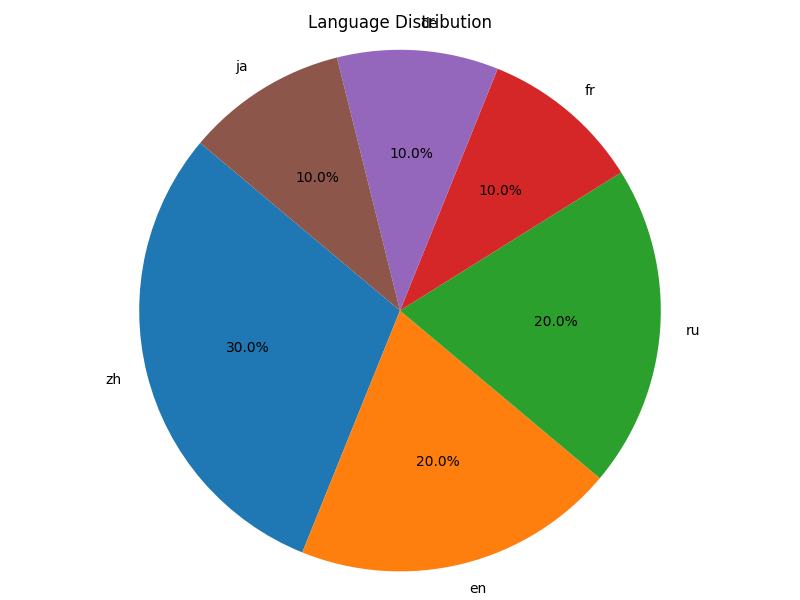

Some common functional functions are provided in data analysis
（1）Average rounds of text analysis code to calculate average rounds (in terms of line breaks)：

```bash
python average_rotation_analysis.py
```

The output is

```bash
Average Rotation in texts: 10.666666666666666
```

（2）Field distribution of text

```bash
python average_rotation_analysis.py
```

Output as nested pie chart


（3）Language distribution of text

```bash
python language_distribution_analysis.py
```

Output as pie chart


（4）Text length analysis

```bash
python text_length_analysis.py
```

The output is

```bash
Average Length of all texts: 72.4
Maximum Length of all texts: 133
Minimum Length of all texts: 21
Median Length of all texts: 85.0
```
