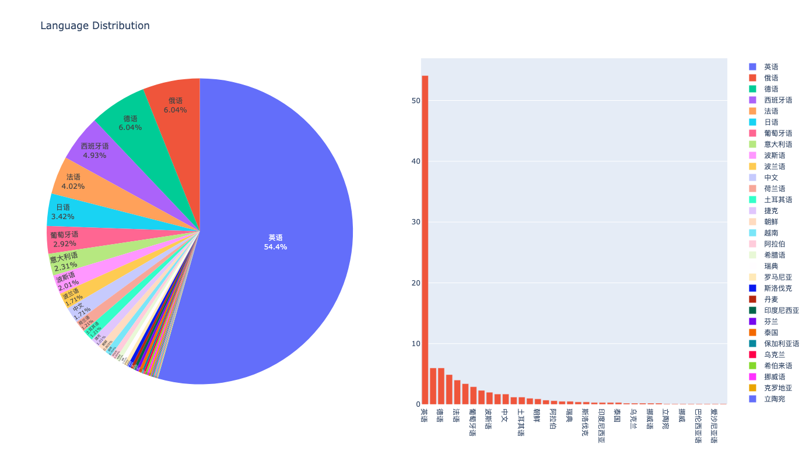

# 数据分析阶段

数据分析中，提供了一些常见的功能函数

（1）文本的平均轮次分析代码，计算平均轮次（以换行符为例）：

```bash
python average_rotation_analysis.py
```

输出为

```bash
Average Rotation in texts: 10.666666666666666
```

（2）文本的领域分布

```bash
python average_rotation_analysis.py
```

输出为嵌套饼图


（3）文本的语言分布

```bash
python language_distribution_analysis.py
```

输出为饼图

（4）文本的长度分析

```bash
python text_length_analysis.py
```

输出为

```bash
Average Length of all texts: 72.4
Maximum Length of all texts: 133
Minimum Length of all texts: 21
Median Length of all texts: 85.0
```
