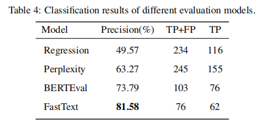

BERT and fasttext were chosen as evaluation models because they have the following advantages:

1. the BERT model performs well in text categorization and comprehension tasks, has strong language understanding and
   representation capabilities, and can effectively assess text quality.
2. FastText models have efficient training and inference speeds while maintaining classification performance, which can
   significantly reduce training and inference time.

The article compares different text categorization models including logistic regression, BERT and FastText to
evaluate their performance. In the experiments, the BERTEval and FastText models perform well in text categorization
tasks, with the FastText model performing best in terms of precision and
recall. [Experimental results from ChineseWebText].



Bert execution python Bert/evaluate.py
The sample data is `flagdata/quality_assessment/Bert/input_data/example_data.jsonl`, the result after
execution`cleared*.jsonl` examples are as follows

```json
{
  "text_id": 1,
  "text": "在强调本金安全的前提下，追求较高的当期收入和总回报。\r\n    投资策略\t本基金将在遵守投资纪律并有效管理风险的基础上，通过价值分析，结合自上而下确定投资策略和自下而上个券选择的程序，采取久期偏离、收益率曲线配置和类属配置等积极投资策略，发现、确认并利用市场失衡实现组合增值......",
  "info": {
    "url": "无",
    "title": [
      "无"
    ],
    "source_domain": ""
  },
  "score": 0.29443359375
}
```

`FastText/models`You can download it from [ChineseWebText](https://github.com/CASIA-LM/ChineseWebText) and execute
python
FastText/evaluate.py --dates FastText/data,This step will assign a FastText score to each data entry, with the results
being stored in a directory such as "FastText/data/fasttext". Subsequently, you can utilize these scores to filter and
extract high-quality data by using a threshold(default set to 0.5).